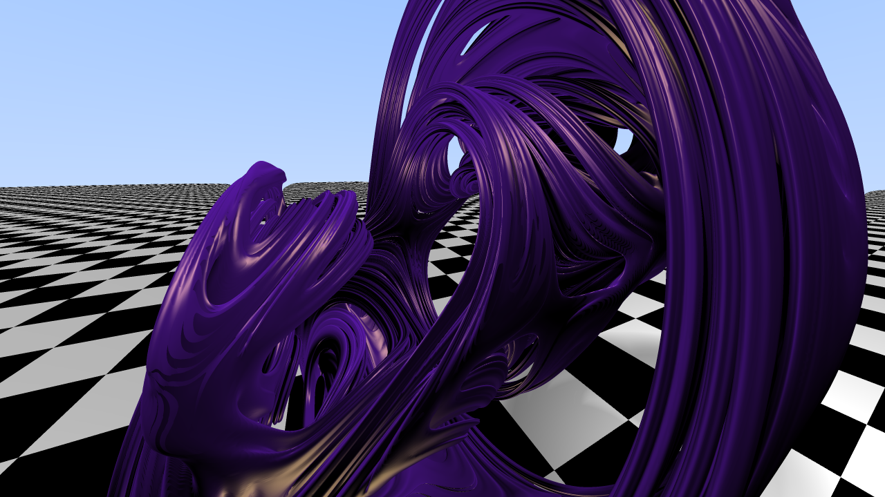

# Fractales
## Fundamentos Matemáticos y Visualización con Ray-Tracing


> **Trabajo de Fin de Grado**
> 
> Doble Grado en Ingeniería Informática y Matemáticas
> 
> **Alumno:** Juan Antonio Villegas Recio
> 
> **Tutor de Matemáticas:** Manuel Ruiz Galán
> 
> **Tutor de Informática:** Carlos Ureña Almagro
> 
> Universidad de Granada
> 
> Curso 2021/2022
> 

<p align="center">

</p>

Este es el repositorio principal en el que pueden encontrarse todos los ficheros correspondientes al proyecto: los guiones de Mathematica, los archivos de $\LaTeX$ utilizados para la elaboración de la memoria, los ficheros de HTML, CSS y JavaScript correspondientes a la web, el código GLSL de los shaders utilizados, imágenes, etc.

Como producto final del proyecto, se sugiere consultar:

* El **despliegue en github pages** de este repositorio: **[jantoniovr.github.io/Geometria-Fractal/](https://jantoniovr.github.io/Geometria-Fractal/)**. Es el producto software principal del proyecto. Consiste en una web interactiva y documentada en la que se permite visualizar fractales tanto 2D como 3D y modificar su apariencia mediante una serie de parámetros.
* La **memoria del TFG**: Disponible en la ruta [`memoria/main.pdf`](./memoria/main.pdf). En la memoria se describen los fundamentos matemáticos y los principales resultados de la geometría fractal de manera rigurosa. Además, también se explica minuciosamente el proceso de desarrollo y la programación del producto software junto con los fundamentos de las técnicas empleadas.
* Los **guiones de Mathematica**: Se pueden consultar en el directorio [`Mathematica`](./Mathematica). Durante los primeros capítulos de la memoria se emplea una gran cantidad de imágenes y se describe y referencia código Mathematica para generarlas. Estos guiones recogen dicho código con explicaciones del mismo y ordenados por secciones de la misma manera que la memoria.

### Uso del producto Software

La web interactiva, que es el producto software desarrollado en este proyecto, puede consultarse y utilizarse desde cualquier navegador desde la dirección **[jantoniovr.github.io/Geometria-Fractal/](https://jantoniovr.github.io/Geometria-Fractal/)**. No obstante, por cuestiones de eficiencia recomendamos ejecutar el proyecto en local. Explicamos el procedimiento en los siguientes párrafos.

1. Primero de todo necesitamos descargar el código de este repositorio. Para ello, mediante una terminal nos situamos en el directorio que deseemos y clonamos el repositorio:

```bash
~$ git clone git@github.com:JAntonioVR/Geometria-Fractal.git
~$ cd Geometria-Fractal
```
Si no se dispone de `git` en la pestaña `Code` se puede encontrar la posibilidad de descargar un `ZIP` con el código.

2. Es necesario lanzar un servidor web local. Para esto, se ofrecen algunas de las alternativas más sencillas. Si se dispone de `Python`, bastaría con ejecutar el comando:

```bash
python -m SimpleHTTPServer 8000 # Si se dispone de Python 2
```
o

```bash
python -m http.server 8000 # Si se dispone de Python 3 (recomendado)
```

Tras esto, abra su navegador en la URL [http://localhost:8000/](http://localhost:8000/) y encontrará la portada del proyecto.

Otra alternativa para los usuarios del editor `Visual Studio Code` (VSCode) es la extensión [`Live Server`](https://marketplace.visualstudio.com/items?itemName=ritwickdey.LiveServer), la cual con tan solo instalarla y pulsar el botón 'Go Live' que aparecerá en la esquina inferior derecha lanza un servidor web en el directorio que se tenga abierto en el momento y abre una ventana en el navegador.

Por último, en [este enlace](https://nodejs.org/en/knowledge/HTTP/servers/how-to-create-a-HTTP-server/) se explica la posibilidad de crear un servidor web utilizando `node.js`.

**Nota:** Con Python se utiliza el puerto 8000, con 'Live Server' el 5500 y con node.js el 8080. Sin embargo, es posible que por cualquier razón esos puertos estén ocupados por otros procesos y aparezca algún error. Si esto ocurre simplemente utilice algún puerto distinto que esté disponible.

3. Independientemente de la opción que hayamos elegido para lanzar el servidor web, tan solo resta abrir el navegador que queramos e introducir la dirección [http://localhost:PPPP/](http://localhost:8000/), siendo `PPPP` el puerto que hayamos elegido finalmente.

Sin nada más que añadir, deseamos que el lector disfrute de todo lo que se le ofrece, comenzando por las siguientes dos imágenes.

<div style="display: flex;">



</div>


